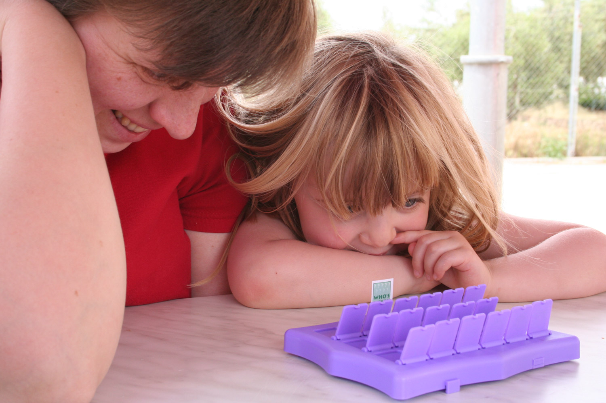

Hannah and Lauren have discovered the joys of playing the classic children's game [Guess Who](http://www.argos.co.uk/ProductDisplayTRK019?partNumber=3700864). The trouble is, they've discovered different joys to the rest of us, which turns a game with them into a supreme test of will which would challenge the likes of Florence Nightingale or Nelson Mandela.

For the record, here's how a normal game of Guess Who goes:

**Player 1:** Does your person have a beard? 
**Player 2:** Yes. 
_Player 1 knocks down all people without beards._ 
**Player 2:** Does your person have red hair? 
**Player 1:** No. 
_Player 2 knocks down all people with red hair._

And so on. But who wants to play like that... when you could play like _this_?

**Hannah:** Does your person haaaaaaave... \[long pause\]... a beard or a moustache? 
**Lauren:** A moustache. 
**Me:** No, Lauren, just say yes or no! 
**Lauren:** OK, no. 
**Nicola:** You mean yes? 
**Lauren:** Yes. A yellow moustache. 
_I hang my head in despair._ 
**Nicola:** Right, come on Hannah. 
**Hannah:** Sooo... moustaches... down? 
**Nicola:** No, think - their person _has_ got a moustache. So... 
**Hannah:** So people... _without_ moustaches... stay _up_? 
**Nicola:** No, they go down. 
**Hannah:** Oh yeah! 
_Hannah and Nicola knock down the moustaches. I suspect Nicola's knocking down the non-yellow ones too._ 
**Me:** Right, our go Lauren. 
**Lauren:** Has your person got a bit of a funny face? 
**Hannah:** Yes!

Give me strength...

