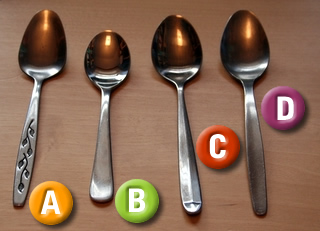

In our kitchen drawer we have many teaspoons. Moreover, we've been able to identify four different types of teaspoon within our collection, a testament to the many that have escaped into the wild over the years and had to be replaced with mismatching ones.

Of these four types, three are recurrent within the collection. The fourth, however, is unique. There is only one of the Fourth Type Of Spoon. Its comrades have long since departed for the great cutlery drawer in the sky. It is the lone survivor.

This fact has not escaped the attention of Hannah and Lauren, who have accorded this spoon the highest of honours. It has become... The Special Spoon. For eating yoghurts there is simply no contest: the Special Spoon is The One.

Note: Two girls. One Special Spoon. (Tell me if I'm ladling this on a bit thick.)

All manner of deviousness can now be observed at yoghurt-eating time, as the girls compete for the ultimate eating experience in which there can be only one victor. For example:

**Lauren:** Daddy, Hannah's got the special spoon! 
**Hannah:** But Lauren had it yesterday! 
**Lauren _(starting to cry)_:** No I didn't, Hannah did! 
**Hannah:** I didn't! Honestly, Daddy! 
**Lauren:** And she's got the special pants on!1 
**Me:** Right, Hannah, if you've got the special pants you can give Lauren the special spoon. 
**Hannah:** Gwmph. _(Sound of spoon being popped into mouth.)_ 
**Lauren:** But it's got her germs on it now! _(Tears.)_ 
**Me:** Hannah, give it to me. _(Spoon is seized.)_ Lauren, shall I wash it for you? 
_Lauren shakes head woefully._ 
**Hannah _(brightly)_:** I'll have it, Daddy! 
**Me:** Hannah, get a spoon and eat your yoghurt.

After all this ritual kerfuffle, you would be forgiven for imagining that the Special Spoon has some kind of compelling aesthetic properties that set it aside from mere normal spoons. Perhaps it's got a handle in the shape or a cat? Or a picture of Barbie on it? Perhaps it has a unique shape to the bowl that somehow makes yoghurts taste better?

Nothing of the sort. And here I throw open to you, the readers, the **Special Spoon Challenge!** The first person to correctly identify the special spoon from the collection below wins a very special prize!2

1 Oh yes, there are special knickers too. They're tatty and pink with a yellow cat on. Don't get me started. 
2 (May contain germs and traces of yoghurt but you can always wash it.)
