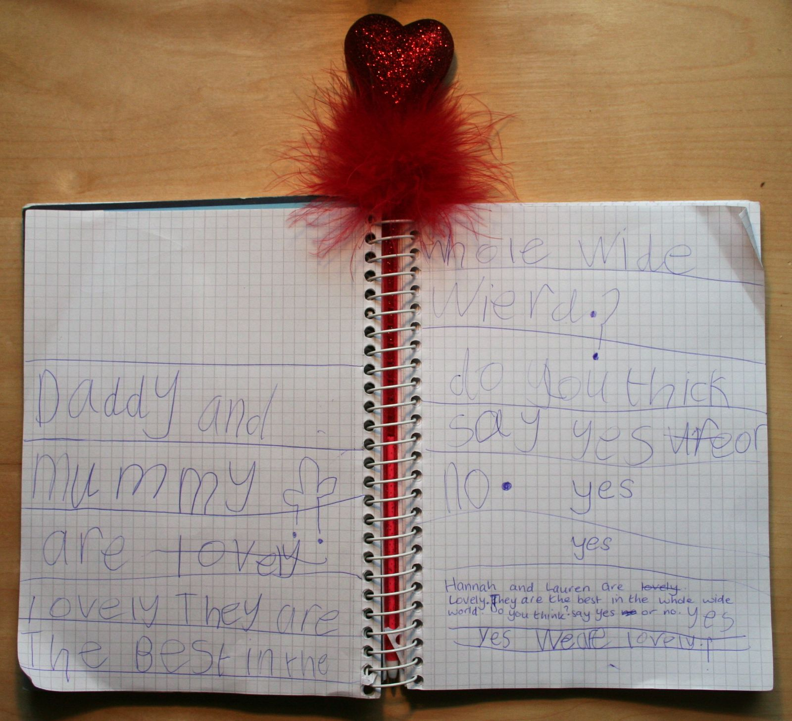

Hannah wrote this questionnaire this morning and got me and Nicola to write in our answers. I suspect we were biased.

The answers to the obvious questions were:

1\. "Oh yeah, it's meant to say 'world'." 
2\. (Regarding the cactus-shaped object) "Er... it's a bogey!"
