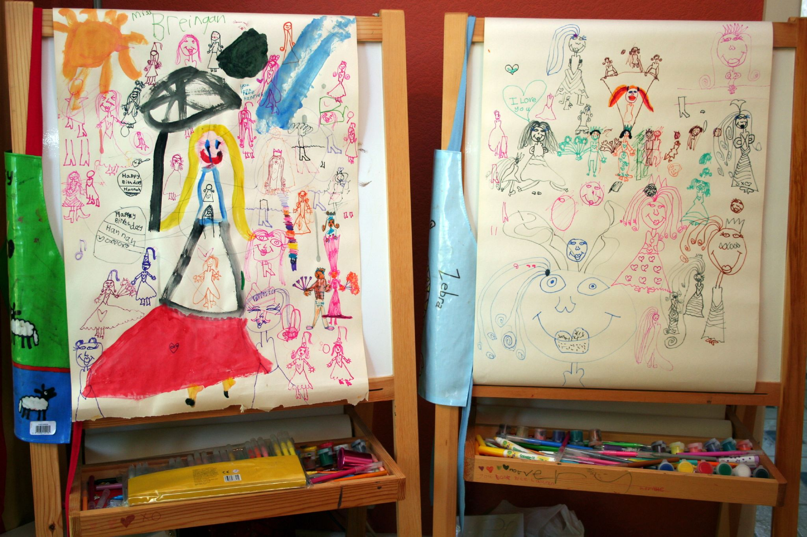

This is a photo taken earlier today of Hannah and Lauren's easels in our dining room:

The girls doodle on their easels after most meals but as you can see the central theme doesn't vary much.

I wonder if anyone can answer the following questions:

(a) Which is Hannah's easel and which is Lauren's? 
(b) Where are the three pictures of me? (Warning: this one's tricky.) 
(c) How many weddings are depicted? 
(d) How many women can you count with long hair? 
(e) How many high-heeled shoes?

I only know the answers to a, b and c. I'll take your word on d and e. :-)

(Flickr users can also leave notes and comments [here](http://www.flickr.com/photos/bitrot/248963480/ "This picture on Flickr.com").)
