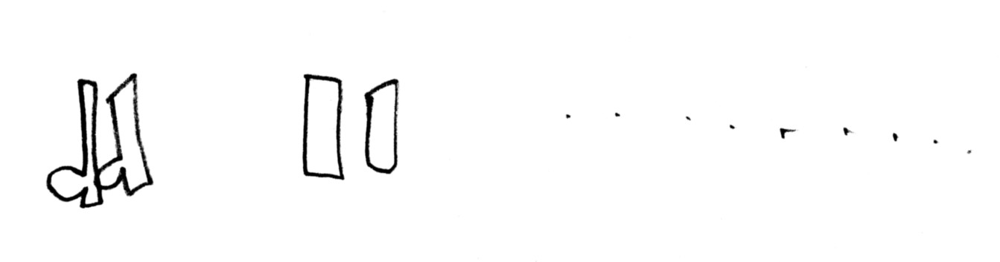

Hannah came home from school the other day with a gold star sticker for "sound pictures". She went on to explain the concept of "sound pictures" with the following example:

From left to right:

1. The thing you want to depict in sound. Hannah chose some high-heeled boots.
2. The instrument you think might sound most like the object - in this case, wood blocks.
3. The rhythm the sound would make.

Lauren chipped in to explain that a police siren would look like a wave. :-)
