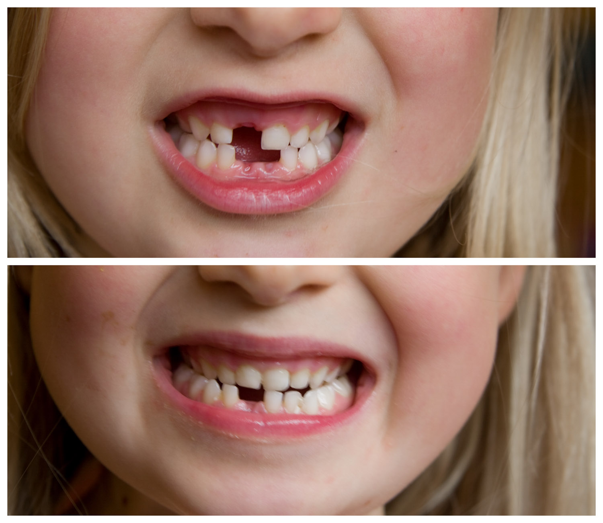
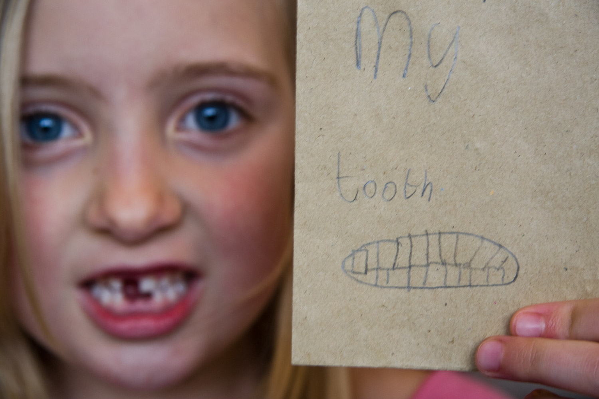

It's been a long time coming, but toothlessness has now come to visit, and it's looking like it'll be a long stay. Lauren's currently ahead with 3 out, but Hannah's got some great "wobblers" in there so she's bound to catch up.

For the record, the first tooth to come out was Lauren's bottom right one, on 1 June 2007 - aged 6 years, 9 months and 23 days. :-)
