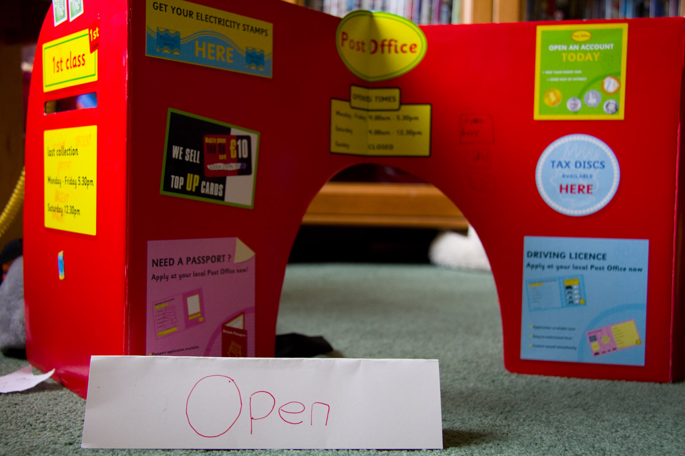

Hannah and Lauren established a revolutionary Pregnancy Post Office in our living room today. It's like a normal Post Office, but where the postmistress (Hannah) is also a trained midwife. It's the kind of diversity I feel all Britain's post offices have been crying out for.

Two conversations overheard this morning. First, **Before**:

**Lauren _(on toy mobile phone)_:** Hi, is that Hannah? 
**Hannah _(also on toy mobile phone, about 1 foot away)_:** Yes 
**Lauren:** Are you a nurse as well? 
**Hannah:** Yeah, I am actually. 
**Lauren:** Good, 'cause I need your help. I'm having a baby! 
**Hannah:** OK. When's it due? 
_\[Thud of Lauren hitting the floor\]_ 
**Lauren:** RIGHT NOW!!

And then, **After**:

**Hannah:** There you go, there's your little baby. 
**Lauren:** Is it a boy or a girl? 
**Hannah:** Er... well, it's just a baby really.

I'm beginning to doubt this postmistress's obstetric qualifications.
