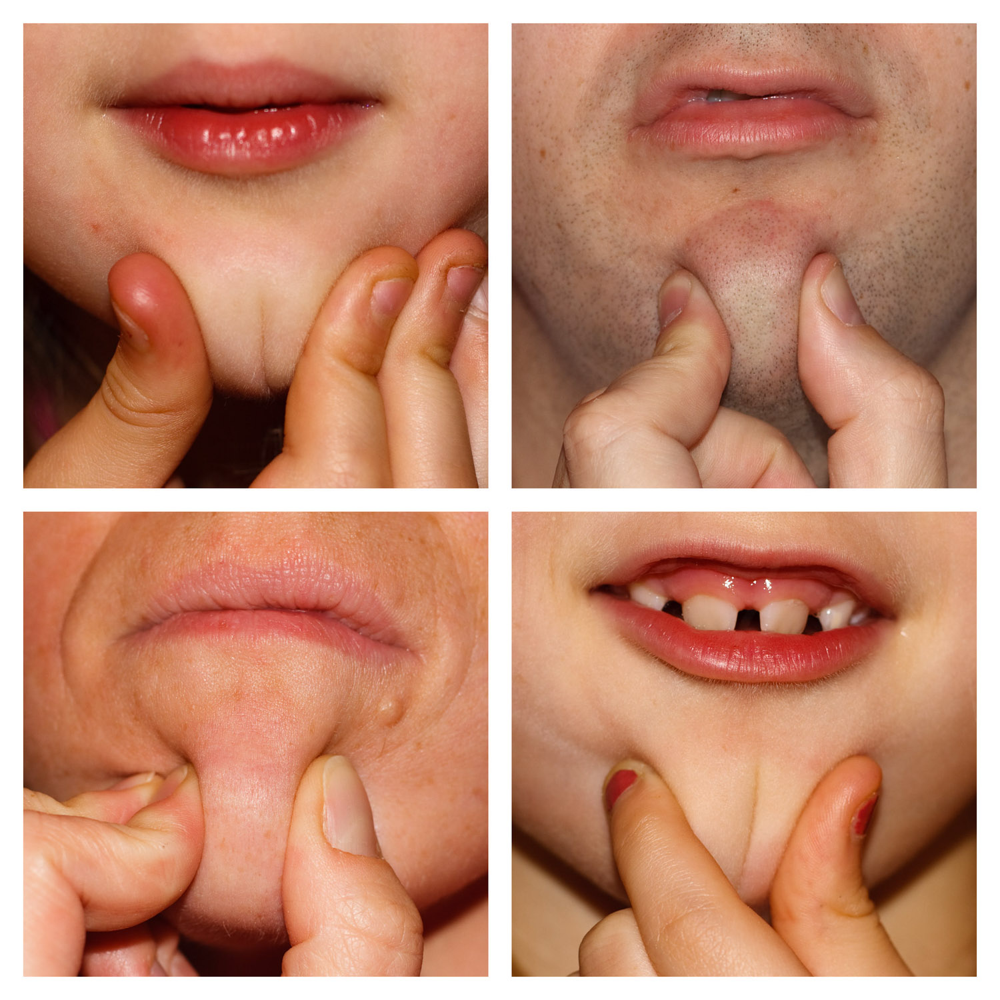

The girls have recently devised an ingenious classification system for chins. Frankly I'm wondering how we as a species have come so far without it.

Pinch your chin between your thumb and forefinger. If it forms a cleft, you're a Baby's Bottom. If it just sort of bulges out, you're a Fat Cherry. For some reason the Baby's Bottom seems the desirable chin-type to have, to the point where the Hannah and Lauren will carefully create a chin-cleft with another finger before submitting for official adjudication. Although interestingly, anyone else caught trying the same thing is clearly the worst kind of chin criminal and is instantly branded a Fat Cherry.

Here are the results from our family. So, what kind of chin is yours?

